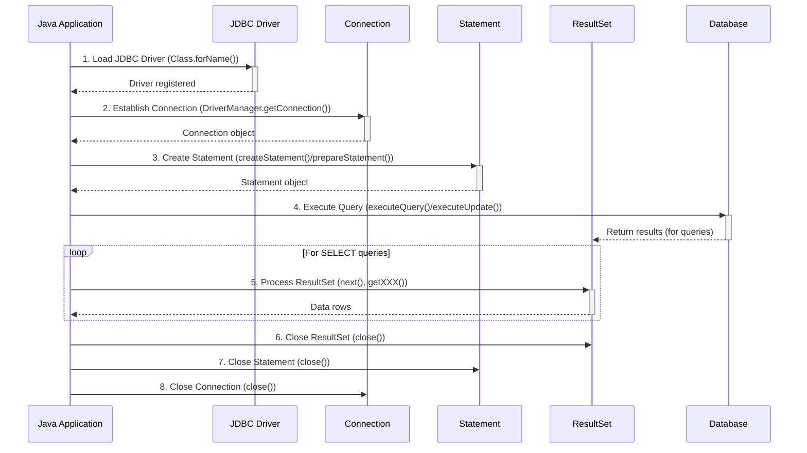
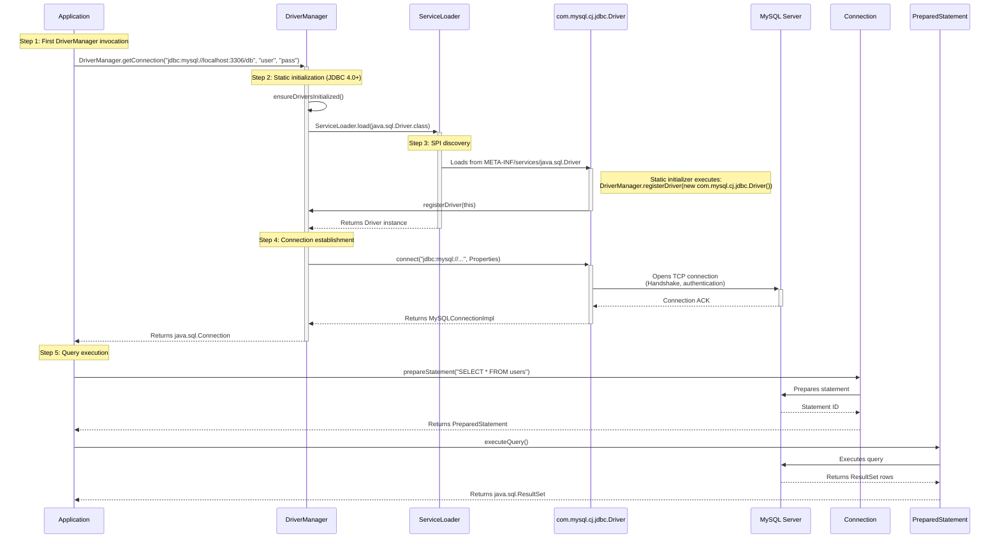

### Steps to Connect Java Applications with Database


1. Load the JDBC Driver (Optional)
```java
Class.forName("com.mysql.cj.jdbc.Driver"); 
```

 2. Register the Drivers Using DriverManager (Optional)
```java
DriverManager.registerDriver(new com.mysql.cj.jdbc.Driver());
```

Note: Step1 and Step2 are optional and no longer used in modern JDBC driver.

3. Establish Connection
```java
Connection con = DriverManager.getConnection(   "jdbc:mysql://localhost:3306/mydb", "user", "password");
```

4. Create Statement
```java
Statement stmt = con.createStatement(); 
// OR
PreparedStatement pstmt = con.prepareStatement("SELECT * FROM users WHERE id=?");
```

5. Execute Query
```java
ResultSet rs = stmt.executeQuery("SELECT * FROM employees");
while(rs.next()) {
    String name = rs.getString("name");
    int id = rs.getInt("id");
}

// OR for updates:
int rows = stmt.executeUpdate("INSERT INTO table VALUES (...)");
```

6. Close Resources (in reverse order)
```java
rs.close();
stmt.close();
con.close();
```





### Why Explicit Driver Loading is Unnecessary




#### 1. DriverManager.getConnection()

- Triggers static initialization via `ensureDriversInitialized()` (Java9+) / `loadInitialDrivers()` (Java 8)  

   ```java
    // In DriverManager.java (JDK 17):
    static {
        ensureDriversInitialized();
    }
	```

- Calls `ServiceLoader.load(Driver.class)` to discover drivers via SPI.
```java
	// In ensureDriversInitialized():
    ServiceLoader<Driver> loadedDrivers = ServiceLoader.load(Driver.class);
```

#### 2. Accurate SPI Interaction

- The **`META-INF/services/java.sql.Driver`** file in the MySQL Connector/J JAR correctly declares the driver class: `com.mysql.cj.jdbc.Driver`

- The driver's **static initializer** calls `DriverManager.registerDriver()` (shown in the diagram).
```java
  // In com.mysql.cj.jdbc.Driver:
    static {
        DriverManager.registerDriver(new Driver());
    }
```

The DriverManager.registerDriver() method adds the driver to its internal list of registered drivers. This list is then used to find an appropriate driver when DriverManager.getConnection() is called.

#### 3. Proper MySQL-Specific Behavior

- The `connect()` method invoked on `com.mysql.cj.jdbc.Driver` is the actual entry point for MySQL connection establishment.
    
- Returns a **MySQL-specific `Connection` implementation** (`MySQLConnectionImpl` in Connector/J).
    


### **Legacy vs Modern JDBC**

| Legacy (Pre-JDBC 4.0)                    | Modern (JDBC 4.0+)         |
| ---------------------------------------- | -------------------------- |
| `Class.forName("com.mysql.jdbc.Driver")` | **No registration needed** |
| Manual driver loading                    | Auto-loaded via SPI        |
| Error-prone (typos in class name)        | Robust auto-discovery      |


### **Best Practice**

1. **Never use `Class.forName()`** – Let the SPI handle it.
    
2. **Keep drivers updated** – Ensures proper `ServiceLoader` registration.
    